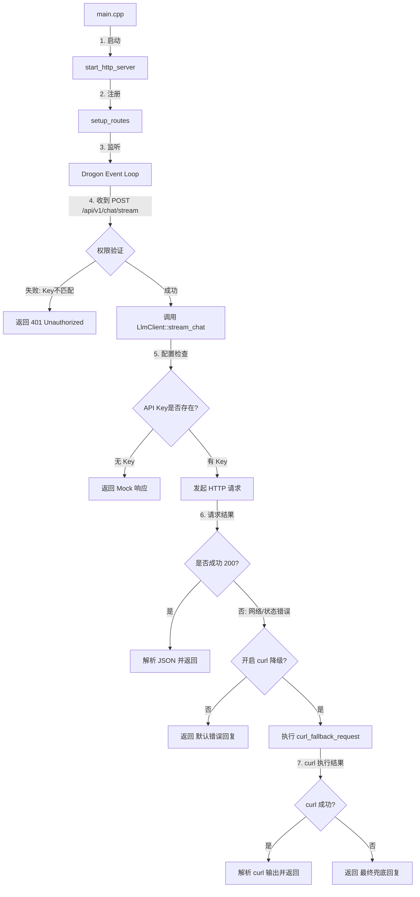

# 整体流程（从 main 开始）

## 目标
用通俗的方式，从 `main` 一路讲到服务启动、路由处理、再到调用 LLM 的全过程。

---

## 学习路线 / 分层
1. **入口层**：`main` 只是启动服务。
2. **服务层**：HTTP 服务启动并注册路由。
3. **路由层**：不同 URL 对应不同业务处理。
4. **模型层**：`LLM` 客户端负责对接外部模型。

---

## 核心架构与流程图

以下是 FinGuard 后端处理 LLM 请求的完整生命周期：



---

## 详细函数调用链

如果你是开发者，这是代码在底层跳跃的路径：

1.  **`main()`** [main.cpp]: 程序的“电源开关”。
2.  **`finguard::start_http_server()`** [http_server.cpp]: 
    *   调用 **`setup_routes()`**。
    *   进入 **`drogon::app().run()`**（进入死循环，等待客人点菜）。
3.  **路由处理器 (Lambda)** [routes.cpp]: 当 `/chat/stream` 被触发：
    *   **`client.load_config()`**: 看一眼厨师的“入场券”（API Key）。
    *   **`client.stream_chat(prompt)`**: 把客人的需求交给主厨。
4.  **`LlmClient::stream_chat()`** [llm_client.cpp]:
    *   **`parse_base()`**: 拆解阿里云地址。
    *   **`drogon::HttpClient::newHttpClient()`**: 拿出手机准备拨号。
    *   **`client->sendRequest()`**: 正式拨打阿里云电话。
5.  **`curl_fallback_request()`** [llm_client.cpp] (仅在电话打不通时):
    *   把客人的需求写在小纸条上（临时文件）。
    *   **`_popen("curl.exe ...")`**: 派“跑腿小弟”带纸条去买菜。
    *   **`parse_completion_payload()`**: 检查买回来的菜（结果）能不能吃（解析 JSON）。

---

## 全局分支路径分析

在这个流程中，程序会面临多次“十字路口”：

### 分支 1：身份验证 (Security Gate)
*   **路径 A (正常)**: 客户端头部的 `X-API-Key` 与本地 `llm.json` 一致。进入下一步。
*   **路径 B (拦截)**: Key 不一致。直接被保安（Drogon Handler）轰走，返回 `401`。

### 分支 2：请求模式 (Working Mode)
*   **路径 A (直连)**: 网络良好，Drogon 库直接连通阿里云。速度最快，开销最小。
*   **路径 B (降级/Fallback)**: 
    *   **触发条件**: `api_base` 解析失败、网络超时或阿里云服务器报 5xx 错误。
    *   **前置开关**: `llm.json` 里的 `use_curl_fallback` 必须为 `true`。
    *   **表现**: 通过启动一个独立的 `curl.exe` 进程来绕过 C++ 库的网络栈限制。

### 分支 3：数据解析 (Data Integrity)
*   **路径 A (成功)**: 收到标准的语义 JSON。提取内容并转为 SSE 流。
*   **路径 B (解析失败)**: 收到乱码或空值。返回带有 `llm_parse_failed` 警告的默认回复，告知用户“厨师听不懂”。

---

## 核心概念解释（生活类比）
把系统想成一家餐厅：
- `main` 是**开门营业**的动作。
- 启动 HTTP 服务是**店长安排厨师和服务员就位**。
- 路由是**菜单**，客人点不同菜就走不同流程。
- `LLM` 客户端像**后厨厨师**，把用户需求加工成答案。
- SSE 流式输出像**一口一口上菜**，不用等整道菜做好。

---

## 关键流程 / 步骤（从头到尾）

### 1) 程序入口：`main`
入口文件只做一件事：启动 HTTP 服务。

```cpp
// 程序入口：只负责启动 HTTP 服务
#include "server/http_server.h"

int main() {
    // 启动 Drogon HTTP 服务
    finguard::start_http_server();
    return 0;
}
```

**解释（生活话）：**
就像餐厅开门，店长只做“开门营业”这一件事，后面细节交给各岗位。

---

### 2) 启动服务：`start_http_server()`
启动时会先注册路由，再开始监听端口。

```cpp
void start_http_server() {
    // 注册全部 HTTP 路由
    setup_routes();

    // 启动 Drogon 服务器
    drogon::app()
        .setThreadNum(4)
        .addListener("0.0.0.0", 8080)
        .run();
}
```

**解释（生活话）：**
像是店长先把菜单贴好（注册路由），然后让餐厅开始接客（监听端口）。

---

### 3) 路由注册：`setup_routes()`
目前有三类路由：
- **健康检查** `/health`
- **模拟资产配置** `/api/v1/plan`
- **流式问答** `/api/v1/chat/stream`

**生活话：**
这是餐厅菜单：
- `/health` 是“看看餐厅是否营业”；
- `/api/v1/plan` 是“来一份固定套餐（mock）”；
- `/api/v1/chat/stream` 是“现场点菜并逐步上菜”。

---

### 4) SSE 流式问答的核心流程
当用户调用 `/api/v1/chat/stream`：

1. **读取用户输入的 `prompt`**
2. **检查 API Key**（服务端配置 + 客户端请求头）
3. **调用 `LlmClient::stream_chat(prompt)`**
4. **将返回的 token、cite、metric、warning 组装成 SSE**
5. **逐步写回客户端**

**生活话：**
客人点菜后：
- 先确认有会员卡（API Key），
- 再把订单交给厨师（`LlmClient`），
- 做好后按顺序上菜（SSE 输出）。

---

### 5) LLM 调用流程（`LlmClient::stream_chat`）
关键逻辑：
1. 读取 `config/llm.json`
2. 拼装请求体（模型、温度、用户输入）
3. 使用 Drogon 发送 HTTP 请求
4. 如果失败且启用 `use_curl_fallback`，就调用 `curl.exe` 作为降级路径
5. 解析返回内容为 `tokens`

**生活话：**
厨师拿到菜单后：
- 先看厨房配方（配置文件），
- 正常用厨房设备做菜（Drogon 直连），
- 如果设备坏了且允许备用方案，就派跑腿买菜（`curl.exe`）。

---

## 真实代码片段（关键位置）

### 路由注册入口
```cpp
void setup_routes();
```

### 流式问答入口（调用 LLM）
```cpp
auto result = client.stream_chat(prompt);
```

### LLM 降级逻辑开关（配置读取）
```cpp
if (doc.contains("use_curl_fallback") && doc["use_curl_fallback"].is_boolean()) {
    cfg.use_curl_fallback = doc["use_curl_fallback"].get<bool>();
}
```

---

## 小结
- `main` 只负责启动服务。
- 服务启动后注册路由并监听端口。
- 关键业务在 `/api/v1/chat/stream`，会调用 `LlmClient`。
- `LlmClient` 负责调用外部模型，失败时可降级到 `curl.exe`。

---

## 自测问题（验收用）
1. `main` 做了哪一件核心事情？
2. 路由注册是在哪一步完成的？
3. 流式问答的核心流程有哪些步骤？
4. 什么时候会使用 `curl.exe` 作为降级？

---

## 下一步建议
- 阅读并理解 `llm_client.cpp` 中的请求构造与错误处理。
- 加一条本地测试脚本，验证 `/health` 与 `/api/v1/chat/stream`。
- 若环境支持，补充真正的流式输出（非假流式）。
